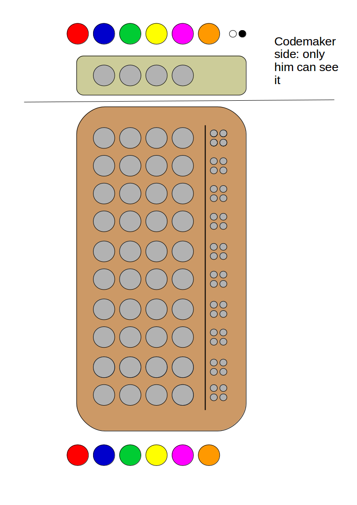
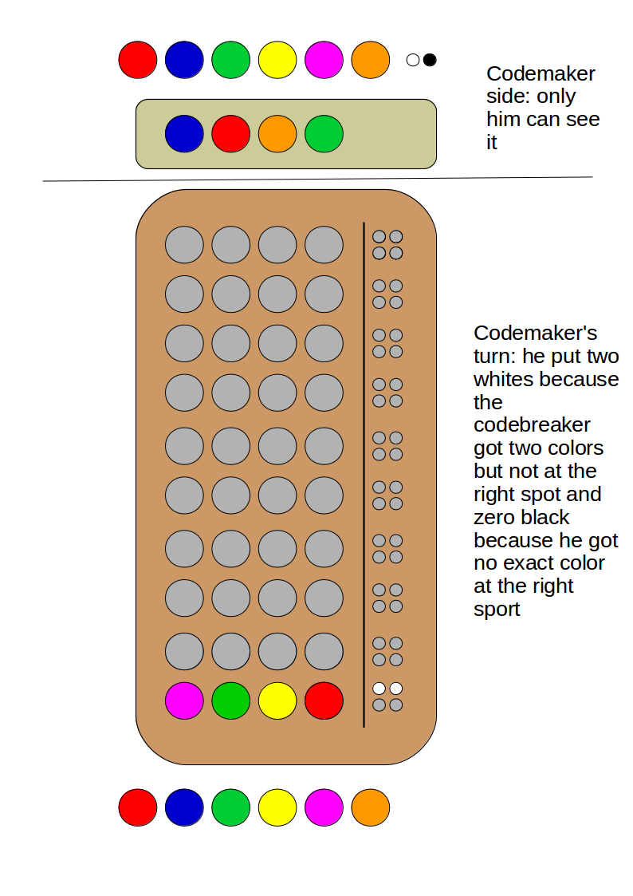
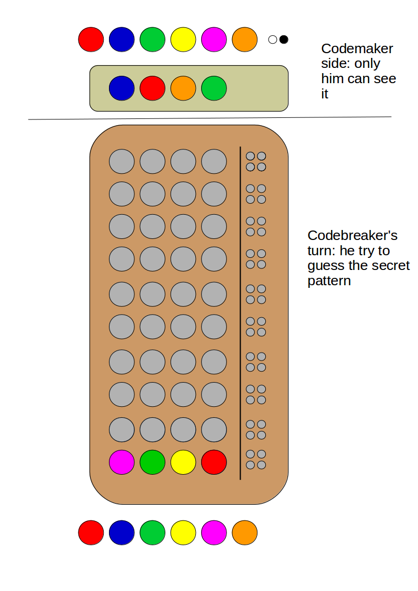
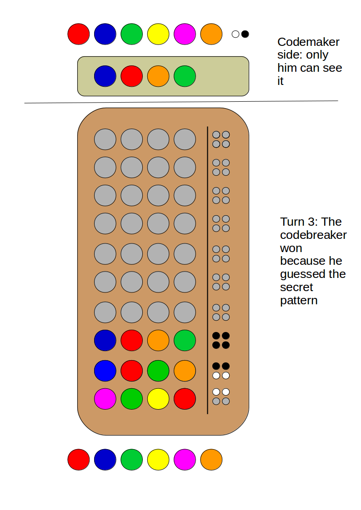

# game-prototype-mastermind
- Second project for Game Design Course at BJTU
- Student: Alex Michaux - id: 15129031

# Target Audience
- People starting from around 8 years old to anyone above it
- People liking cerebral games where you have to think but with simple rules
- People liking turn based game but where the game doesnt last for too long (5 to 10 minutes)
- People looking to just pass some time in between other activities

# Game Player(s)
2 Players play against each other :
  - One is the codemaker
  - One is the codebreaker

# Game World
- A game board :
  - separated in two columns of 10 rows :
    - each line in the first column has 4 big holes
    - each line in the second column has a square of 4 small holes
  - an aditionnal special line of 4 big holes hidden away from the codebreaker
- Infinite number of big pegs of 6 different colors (no black or white)
- Infinite number of small pegs of 2 different colors (black and white)

# Goal
For the codebreaker to find the color pattern of the codemaker

# Game Rules
- Big pegs can only go into big holes
- Small pegs can only go into small holes
- Once pegs are in a hole, they can't move away from it until the end of the game
- At the beggining of the game, the codemaker chooses 4 big pegs and puts them in his chosen order in the special line of big holes that only him can see
- His pattern of color can include the same color several times
- The game start when the codemaker is done making his pattern
- Once the game start, the codebreaker will only interact with big pegs and the first column of the board, while the codemaker will only interact with small pegs and the second column of the board
- The game is turn based, alternating players
- First turn is played by the codebreaker
- For each one of his turn, the codebreaker has to play in the first bottom line that hasn't been played yet
- During his turn, the codebreaker chooses a pattern of 4 big pegs and puts them in his chosen order in a line of big holes and end his turn
- During his turn, the codemaker has to compare the pattern the codebreaker just chose to his hidden pattern of colors. He then puts small pegs accordingly in the second column in the square next to the line the codebreaker just played in
- He will put 0 to 4 pegs
- He must put one black pegs for each correct color in the right spot in the codebreaker pattern
- He must put one white pegs for each correct color but not in the right spot in the code breaker pattern
- He then ends his turn and the codebreaker can try to guess again
- If the pattern of colors is exactly the same as the codemaker's one, the codebreaker won, if not the turn then goes to the codemaker
- Pattern being the same means the 4 same colors as the codemaker in the same order
- At the end the 10th turn, when all the lines are full of pegs, if the codebreaker didn't find the right pattern, he lost the game

# Prototype

_____________________________________________________

_____________________________________________________

_____________________________________________________

_____________________________________________________

